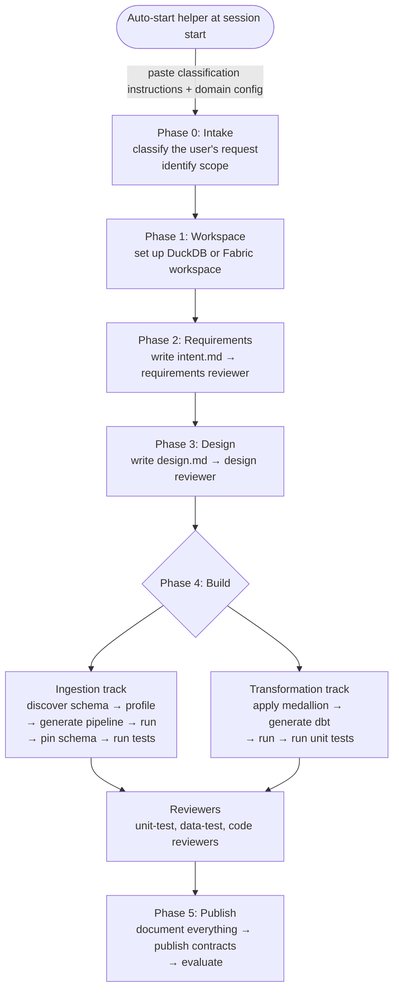
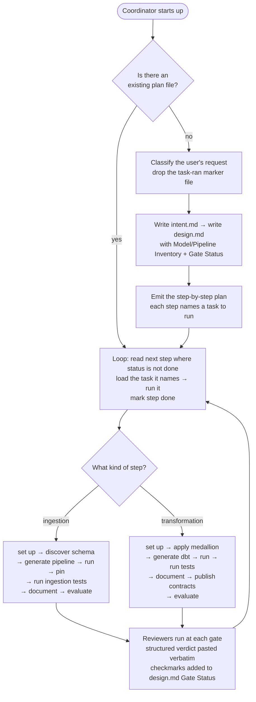

# Side-by-Side Flow Diagrams

## Older version (5.8.0) — driven by an auto-start helper, organised into six phases



## Newer version (0.1.3) — driven by the step-by-step plan



## What moved where

```mermaid
flowchart LR
    subgraph Old["Older plugin (5.8.0)"]
        Oh[Auto-start helper script]
        Ol[Supporting library:<br/>contracts + error codes<br/>+ readiness + templates]
        Os[Helper scripts:<br/>Fabric helpers + validators]
        Osh[Shared references (flat layout)]
    end

    subgraph New["Newer plugin (0.1.3-med)"]
        Nsh[Shared folder:<br/>conventions, playbooks,<br/>patterns tagged variant: med,<br/>templates including the plan template]
        Nc[Coordinator's prompt<br/>absorbed classification trigger<br/>and plan/resume logic]
        Ne[Pushed outside the plugin:<br/>repo-level CI,<br/>Studio host validation]
    end

    Oh -. removed .-> Nc
    Ol -. mostly removed .-> Nsh
    Ol -. some validation .-> Ne
    Os -. removed .-> Ne
    Osh -. reorganised .-> Nsh
```
