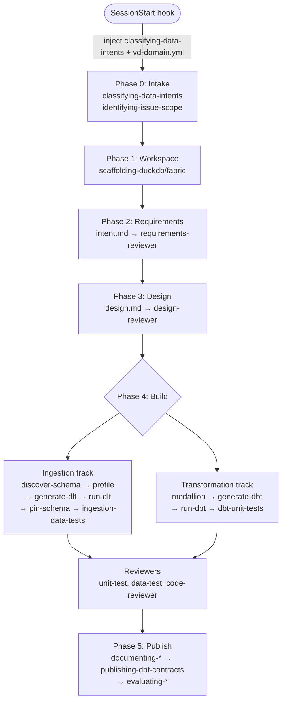
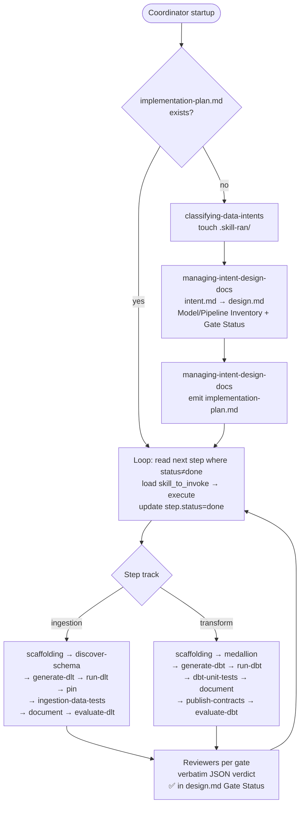
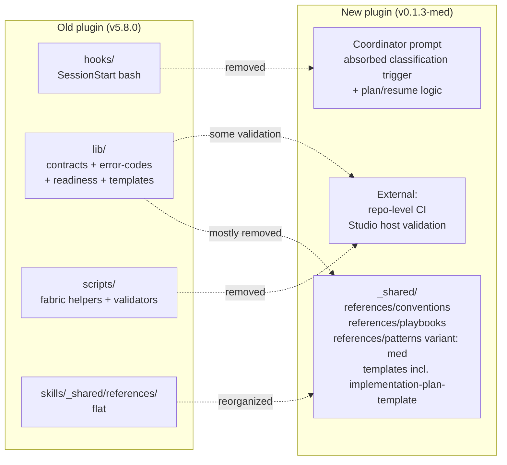

# Side-by-Side Flow Diagrams

## Old version (v5.8.0) — hook-driven, six-phase

```mermaid
flowchart TD
    Hook([SessionStart hook])
    Hook -->|inject classifying-data-intents + vd-domain.yml| P0

    P0[Phase 0: Intake<br/>classifying-data-intents<br/>identifying-issue-scope]
    P1[Phase 1: Workspace<br/>scaffolding-duckdb/fabric]
    P2[Phase 2: Requirements<br/>intent.md → requirements-reviewer]
    P3[Phase 3: Design<br/>design.md → design-reviewer]
    P4{Phase 4: Build}
    P4a[Ingestion track<br/>discover-schema → profile<br/>→ generate-dlt → run-dlt<br/>→ pin-schema → ingestion-data-tests]
    P4b[Transformation track<br/>medallion → generate-dbt<br/>→ run-dbt → dbt-unit-tests]
    P4c[Reviewers<br/>unit-test, data-test, code-reviewer]
    P5[Phase 5: Publish<br/>documenting-* → publishing-dbt-contracts<br/>→ evaluating-*]

    P0 --> P1 --> P2 --> P3 --> P4
    P4 --> P4a --> P4c
    P4 --> P4b --> P4c
    P4c --> P5
```

## New version (v0.1.3) — plan-driven

```mermaid
flowchart TD
    Start([Coordinator startup])
    Start --> Resume{implementation-plan.md<br/>exists?}
    Resume -->|yes| Loop
    Resume -->|no| Classify

    Classify[classifying-data-intents<br/>touch .skill-ran/]
    Design[managing-intent-design-docs<br/>intent.md → design.md<br/>Model/Pipeline Inventory + Gate Status]
    Plan[managing-intent-design-docs<br/>emit implementation-plan.md]

    Loop[Loop: read next step where status≠done<br/>load skill_to_invoke → execute<br/>update step.status=done]

    Classify --> Design --> Plan --> Loop

    Loop --> Track{Step track}
    Track -->|ingestion| ING[scaffolding → discover-schema<br/>→ generate-dlt → run-dlt → pin<br/>→ ingestion-data-tests<br/>→ document → evaluate-dlt]
    Track -->|transform| TR[scaffolding → medallion<br/>→ generate-dbt → run-dbt<br/>→ dbt-unit-tests → document<br/>→ publish-contracts → evaluate-dbt]
    ING --> Gate
    TR --> Gate
    Gate[Reviewers per gate<br/>verbatim JSON verdict<br/>✅ in design.md Gate Status]
    Gate --> Loop
```

## What moved

```mermaid
flowchart LR
    subgraph Old["Old plugin (v5.8.0)"]
        Oh[hooks/<br/>SessionStart bash]
        Ol[lib/<br/>contracts + error-codes<br/>+ readiness + templates]
        Os[scripts/<br/>fabric helpers + validators]
        Osh[skills/_shared/references/<br/>flat]
    end

    subgraph New["New plugin (v0.1.3-med)"]
        Nsh[_shared/<br/>references/conventions<br/>references/playbooks<br/>references/patterns variant: med<br/>templates incl. implementation-plan-template]
        Nc[Coordinator prompt<br/>absorbed classification trigger<br/>+ plan/resume logic]
        Ne[External:<br/>repo-level CI<br/>Studio host validation]
    end

    Oh -. removed .-> Nc
    Ol -. mostly removed .-> Nsh
    Ol -. some validation .-> Ne
    Os -. removed .-> Ne
    Osh -. reorganized .-> Nsh
```
